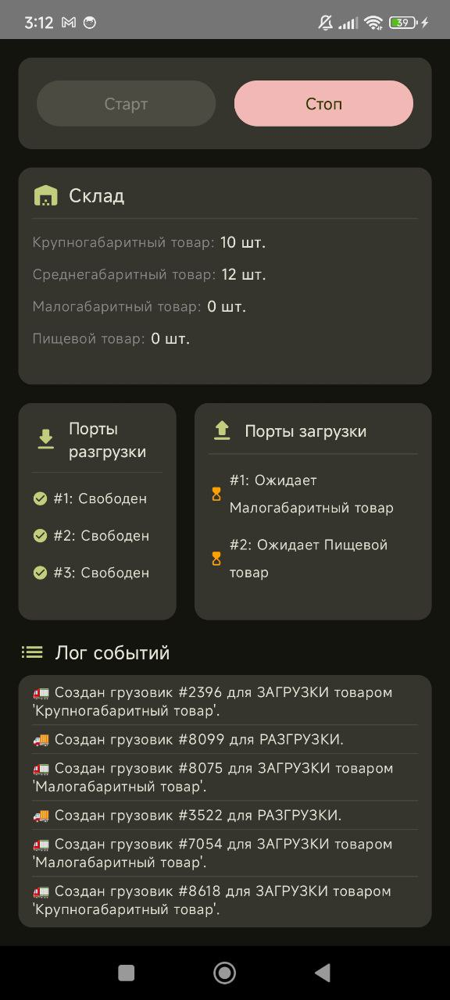

# Симулятор Распределительного Центра

Проект представляет собой приложение для Android, симулирующее работу распределительного (логистического) центра в реальном времени. Приложение визуализирует процессы прибытия, разгрузки и загрузки грузовиков, а также отслеживает состояние склада.

---

## 🚀 Основные возможности

* **Асинхронная симуляция:** Вся логика построена на Kotlin Coroutines, что обеспечивает плавную и неблокирующую работу интерфейса.
* **Динамическое отображение:** Состояние портов (разгрузки и загрузки) и склада обновляется в реальном времени.
* **Генерация событий:** Грузовики для разгрузки и загрузки генерируются случайным образом через определенные промежутки времени.
* **Визуализация процессов:** Анимации и иконки показывают текущий статус каждого порта (свободен, в работе, ожидает товар).
* **Логирование событий:** Все ключевые события (создание грузовика, начало/конец операции) записываются в удобочитаемый лог.
* **Современный UI:** Пользовательский интерфейс построен полностью на Jetpack Compose.

---

## 📸 Скриншот приложения

  

---

## 🛠️ Технологии и архитектура

* **Язык:** Kotlin
* **UI:** Jetpack Compose
* **Асинхронность:** Kotlin Coroutines (Channels, Jobs, Scopes)
* **Архитектура:** MVVM (ViewModel для управления состоянием и логикой UI)
* **Управление состоянием:** `MutableStateFlow` для реактивной передачи данных от ViewModel к UI.
* **Синхронизация:** `Mutex` для обеспечения потокобезопасного доступа к общему состоянию склада.

---

## 📁 Структура проекта

Проект организован по функциональным модулям (пакетам):

* `models`: Содержит классы данных (`Truck`, `Product`, `ProductCategory`, `TruckType`).
* `warehouse`: Класс `Warehouse`, управляющий состоянием склада.
* `ports`: Классы `LoadingPort` и `UnloadingPort`, реализующие логику обработки грузовиков.
* `generators`: Функции для создания случайных грузовиков.
* `ui`: Composable-функции для построения пользовательского интерфейса.

---

## ⚙️ Как запустить

1.  Клонируйте репозиторий на свой компьютер.
2.  Откройте проект в последней версии Android Studio.
3.  Соберите проект и запустите его на эмуляторе или физическом устройстве Android (Min SDK 24).